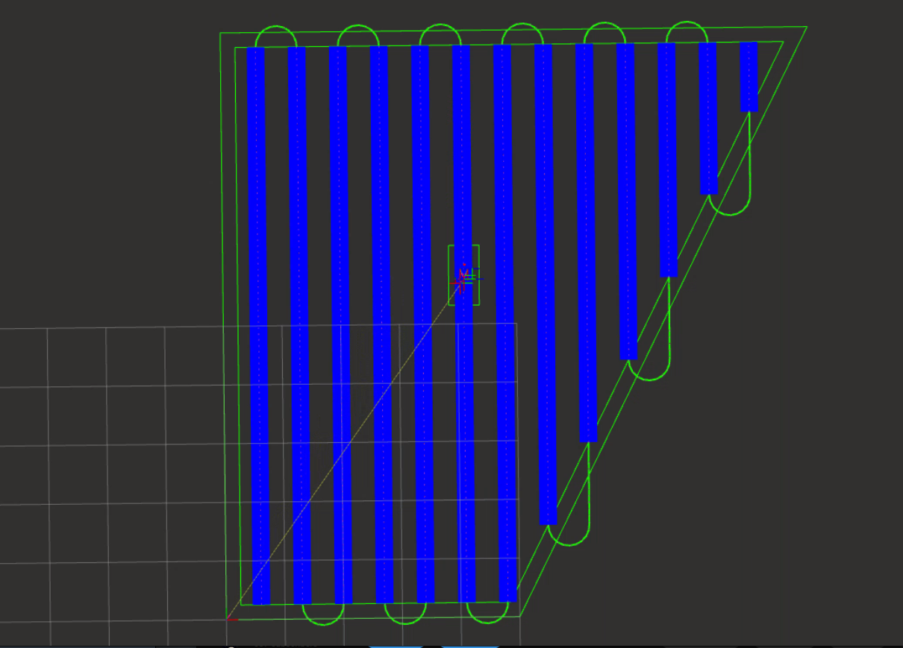

# Things we can use for the demo / poster
[] Footage of loop closure using OAK-D camera in rviz.

[] Images or footage of planned swaths or path produced by coverage server in rviz. Something like this:
    

    We can also include an image of the interest area before the coverage server was run. 

[] real footage of the robot navigating indoors or outdoors. 

[] optional if we have time, the coverage server also predicts the remaining time / distance remaining to the end, we can perhaps have a custom made message that updates a progress bar of covered area. 
