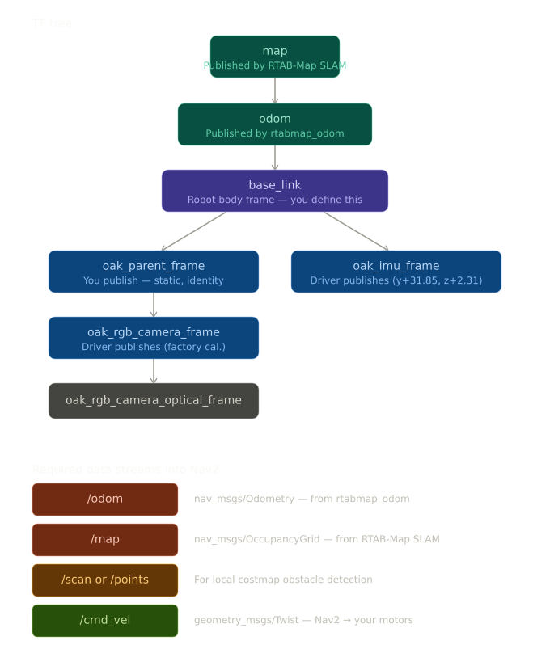

## TF [x]

- Note: this tree is not perfectly accurate, in reality `oak_imu_frame` is the child of `oak_parent_frame`, check the [tf tree](vio/tf_tree.pdf).
- Nav2 only requires the `map → odom → base_link` chain. Nav2's planner and controller operate entirely in terms of `base_link`. If `footprint` in nav2_params.yaml is defined as a simple polygon (e.g. a rectangle), Nav2 uses that directly and never consults wheel TF frames. Most ground robots do this.

- Status: 

        [x] map → odom

        [x] odom → base_link

        [x] base_link → oak_parent_frame simple tatic transform

        [x] oak_parent_frame subtree

        [x] verify final chain

## Depth
- Nav2's local costmap needs to know where obstacles are right now, independent of the global map. 

- Status:

        [x] The `/oak/stereo/image_raw topic` gives 16-bit depth at 640×400. Convert this to a 2D LaserScan (using depthimage_to_laserscan) or pass the raw depth image directly to Nav2's depth_layer plugin.

- Hidden assumption here: The OAK-D's depth has a minimum range (roughly 200–400 mm). Objects closer than that won't appear. We should factor this into our robot's inflation radius settings in the costmap (`nav2_params.yaml`).

## Nav2 config
- [x] map_topic: `/map` # produced by RTAB-Map node can be used in `global_costmap`. Use depth feed for `local_costmap`. 